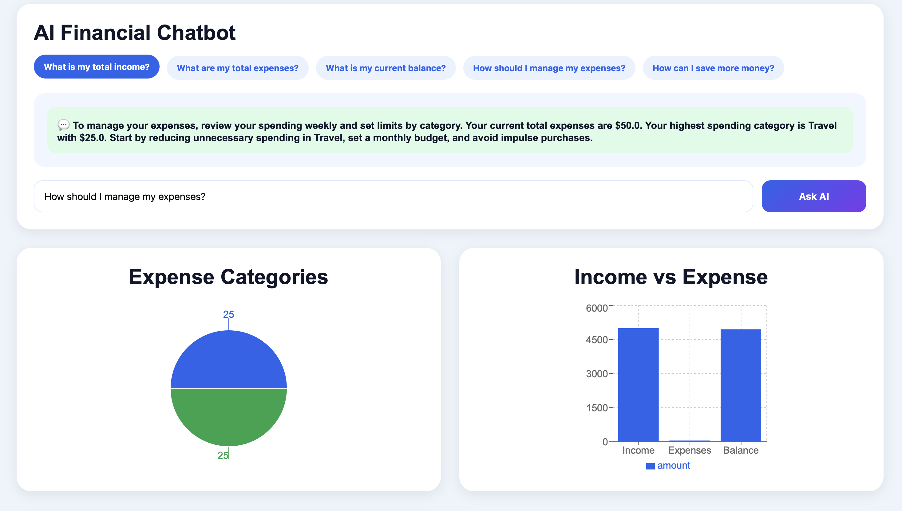

# AI Budget Tracker

An AI-powered personal finance management web application that helps users track income and expenses, upload bank statements, analyze spending trends, and receive smart financial insights using AI.

## Live Demo

Frontend:
https://ai-budget-tracker-sigma.vercel.app

Backend API:
https://ai-budget-tracker-backend.onrender.com/docs

GitHub Repository:
https://github.com/SadvikKondadi/AI-Budget-Tracker

---

# Features

- User Authentication (Register/Login)
- Add Income & Expense Transactions
- Edit & Delete Transactions
- Monthly Budget Management
- AI Expense Category Prediction
- AI Financial Chatbot
- AI Spending Prediction
- Upload Bank Statements
- PDF / CSV / Excel Support
- Delete Uploaded Statement Transactions
- Search & Filter Transactions
- Expense Pie Chart Visualization
- Income vs Expense Analysis
- Monthly Expense Trend Graph
- Export Dashboard as PDF
- Fully Responsive UI
- Cloud Deployment using Render + Vercel

---

# Tech Stack

## Frontend
- React.js
- Vite
- Axios
- Recharts
- HTML/CSS

## Backend
- FastAPI
- Python
- SQLAlchemy
- PostgreSQL
- Passlib Authentication
- PDFPlumber
- Pandas

## Deployment
- Render (Backend + PostgreSQL)
- Vercel (Frontend)
- GitHub

---

# AI Features

## AI Expense Prediction
Automatically predicts spending trends based on user transactions.

## AI Expense Categorization
Uses machine learning logic to predict transaction categories.

## AI Financial Chatbot
Provides smart responses for:
- Expense management
- Savings suggestions
- Income analysis
- Budget advice
- Financial insights

---

# Supported File Uploads

Users can directly upload:
- CSV Bank Statements
- Excel Statements (.xlsx)
- PDF Bank Statements

The application automatically extracts transactions and stores them in the database.

---

# Dashboard Features

- Total Income Summary
- Total Expense Summary
- Current Balance
- Spending Prediction
- Expense Distribution Pie Chart
- Income vs Expense Bar Graph
- Monthly Expense Trend Line Chart

---

# Screenshots

Create a folder named:

screenshots

Add:
- Login Page
- Dashboard
- AI Chatbot
- Charts
- PDF Export
- Statement Upload

Then include:

## Screenshots





---

# Installation Guide

## Clone Repository

```bash
git clone https://github.com/SadvikKondadi/AI-Budget-Tracker.git

cd AI-Budget-Tracker
```

---

# Backend Setup

```bash
cd backend

python3 -m venv venv

source venv/bin/activate

pip install -r requirements.txt

uvicorn main:app --reload
```

Backend runs on:

```text
http://127.0.0.1:8000
```

---

# Frontend Setup

```bash
cd frontend

npm install

npm run dev
```

Frontend runs on:

```text
http://localhost:5173
```

---

# Deployment

## Backend
Deployed on Render with PostgreSQL database.

## Frontend
Deployed on Vercel using Vite configuration.

---

# Future Improvements

- Real AI/LLM integration
- OCR for scanned statements
- Mobile App Version
- Voice-based financial assistant
- Investment tracking
- Savings goal planner
- Email expense reports
- Dark mode support

---

# Author

## Sadvik Kondadi

- MS in Computer Science – University of North Texas
- AI & Data Engineering Enthusiast

LinkedIn:
https://www.linkedin.com/in/sadvik-kondadi/

GitHub:
https://github.com/SadvikKondadi
